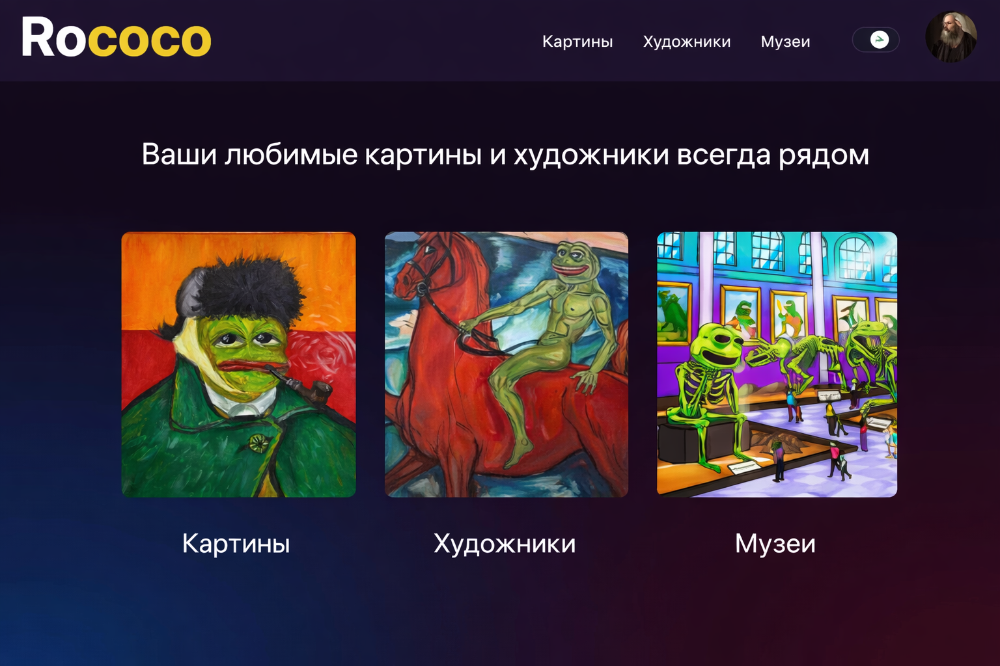
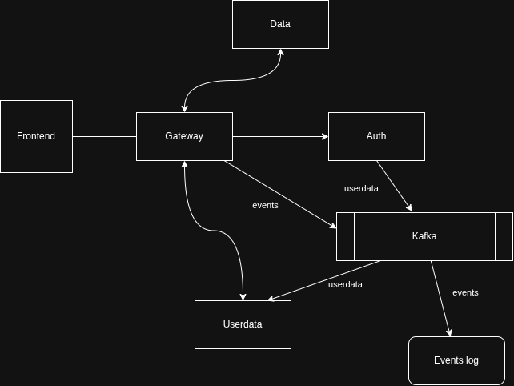

# Что такое Rococo?

  Привет! Меня зовут Крючков Павел и я студент 10-го потока курса Java Advanced 2.0 от [QAGURU](https://qa.guru/)

  Это мой дипломный проект ROCOCO. Мне дали готовый фронтенд и сервис авторизации.
Я реализовал бэкенд и проект с end to end автотестами. Хотел бы немного рассказать о них.

  Rococo - стиль в искусстве (живописи и не только), а еще это сервис-каталог в котором хранятся данные о художниках, музеях
и картинах. При добавлении картины в каталог указывается кто автор картины,и в каком музее она находится. Для каждого художника мы можем посмотреть список его картин.
Добавить или отредактировать картину, художника или музей может только зарегистрированный пользователь, но просматривать может любой.
Звучит просто, но это мои первые шаги, чтобы самому творить искусство.



# Что я использовал?

- Микросервисный бэкенд на Spring Boot
- REST API для взаимодействия фронтенда с бэкендом
- gRPC и Kafka для взаимодействия между микросервисами
- MySQL в качестве базы данных
- Hibernate для работы с базой данных
- Retrofit для API-тестов
- Selenide для WEB-тестов
- Selenoid для запуска браузеров в Docker
- Allure для формирования отчетов
- GitHub Actions для запуска проверок при pull request

# Как это работает?
  Пользователь заходит на главную страницу и видит три карточки каталога: Картины, Художники, Музеи
Кликнув по ним будут выведены списки соответственно всех картин художников и музеев.
Внутри можно провалиться в каждую сущность и посмотреть дополнительную информацию по ней.
Например для художников покажется список всех его картин. 


  Также пользователь может зарегистрироваться и войти, в таком случае на странице со списками ему доступно добавление,
а внутри каждой отдельной карточки редактирование. Еще он может отредактировать данные о себе.

Внутри это работает так:
- При работе с данными художников, музеев, картин или данными пользователя запросы приходят на Gateway сервис
- Gateway сервис проверяет возможность совершения операции согласно SecurityConfig 
- Затем Gateway проксирует запросы в сервис Data и Userdata для пользователей
- При регистрации и логине запросы приходят а auth-service 
- auth-service сервис создает у себя пользователя и его права
- Затем auth-service через Kafka откидывает событие в Userdata
- Сервис Data совершает все CRUD операции с данными художников, картин и музеев
- Сервис Userdata работает только с данными пользователя, такими как имя, фамилия, аватар
- Все операции, которые проходят через Gateway логируются событиями в Kafka
- Сервис Events вычитывает эти события и пишет лог в свою базу



Все PATCH запросы работают как и задумано, то есть будет обновлено только присланное поле.
В логи Events также попадает username пользователя, если операция требует авторизацию

# Как это тестируется?
- У сервисов написаны Unit тесты
- Для проекта с e2e тестами написаны Junit extension для создания тестовых данных
- Логин происходит в тестах по апи, если не требуется проверка самого логина
- Для Selenide написаны обычные Page Object, из тестов старался вынести шаги в сами Page Object
- Тесты проверяют сценарии как для авторизованных операций, так и для неавторизованных
- Результаты формируются в Allure отчет
- Запускаются GitHub Actions при пулл-реквесте

# Как запустить локально?

#### 1. Выполни скрипт из корня проекта, запустятся необходимые контейнеры:
```posh
bash localenv.sh
```
#### 2. Запусти сервисы указав профиль local

#### 3. Выполни скрипт из корня проекта, запустится фронтенд:
```posh
cd rococo-client
npm i
npm run dev
```

#### 4. Перейди в браузере на:
```posh
http://localhost:3000/
```

# Как запустить в докере?

#### 1. Выполни скрипт из корня проекта, запустится проект в докере
```posh
bash docker-compose-test.sh build
```

# Что хотел сделать, но не успел?

- Реализовать отдельное хранилище файлов
- Написать тесты на gRPC
- Разнести единый сервис data на отдельные сервисы для музеев, художников и картин
- Сделать полноценные скриншотные тесты
- Улучшить фронтенд: сортировку, поиск художников и музеев при добавлении, работу со скроллами
- Реализовать больше кастомных Selenide Condition
